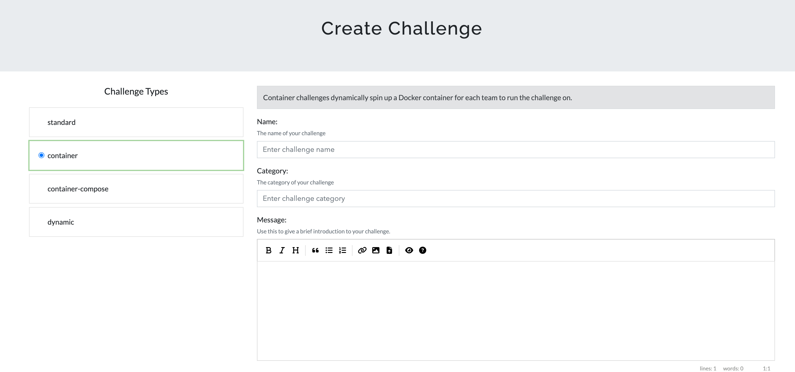
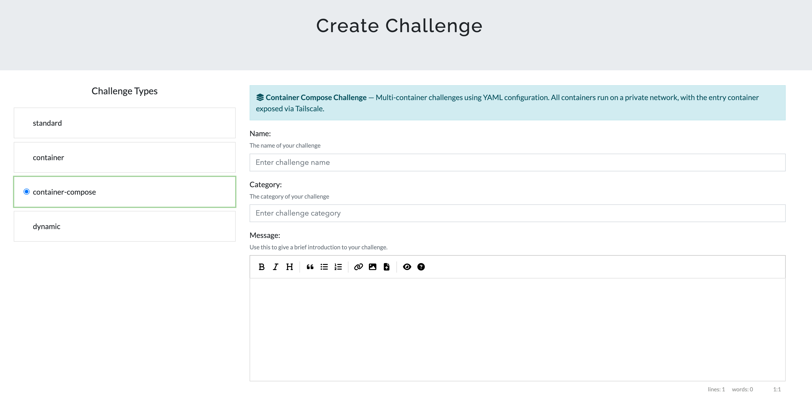
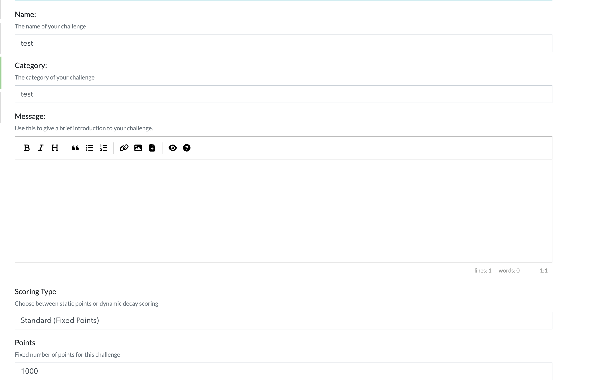
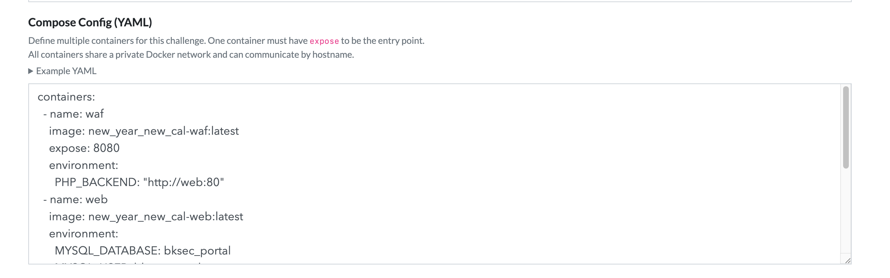
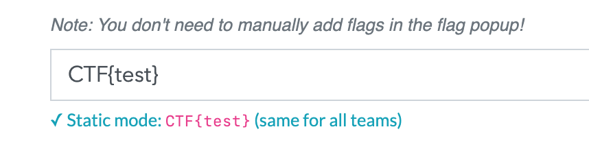
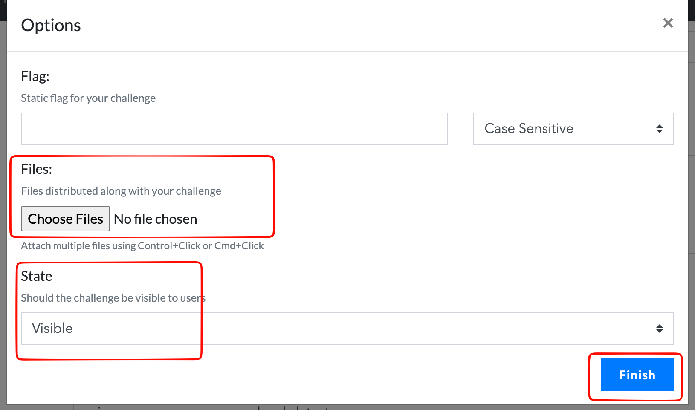

# CTFd Docker Container Challenge Plugin

A comprehensive CTFd plugin that enables dynamic Docker container challenges with advanced features including anti-cheat detection, automatic flag generation, dynamic scoring, and bulk import capabilities.

## Features

### Container Management

- **Dynamic Container Spawning**: Each team/user gets their own isolated Docker container
- **Automatic Lifecycle Management**: Containers auto-expire after configurable timeout
- **Resource Control**: Global limits for CPU, memory, and process count
- **Port Management**: Automatic port allocation and mapping
- **Custom Naming**: Containers named as `challengename_accountid` for easy identification
- **Subdomain routing**: Generate subdomain for each WEB challenge. Read more [here](./SUBDOMAIN_INFO.md)
- **Container Compose Mode**: Multi-container challenges with private networking and DNS aliases
- **Traefik Routing for Compose**: Compose challenges can route via Traefik instead of Tailscale — no port allocation needed
- **Label Placeholder Substitution**: Dynamic Traefik labels with `{uuid}`, `{instance_name}`, `{account_id}`, etc.

### Anti-Cheat System

- **Flag Reuse Detection**: Automatically detects when teams share flags
- **Instant Ban**: Both flag owner and submitter get banned immediately
- **Audit Logging**: Complete trail of all container and flag activities
- **Cheat Dashboard**: Admin view of all detected cheating attempts

### Scoring Options

- **Standard Scoring**: Fixed points per challenge
- **Dynamic Scoring**: Points decay as more teams solve
  - Linear decay: `value = initial - (decay × solves)`
  - Logarithmic decay: Parabolic curve with minimum floor

### Flag Generation

- **Static Flags**: Same flag for all teams (e.g., `CTF{static_flag}`)
- **Random Flags**: Unique per-team flags with pattern (e.g., `CTF{this_is_the_flag_<ran_8>}` -> `CTF{this_is_the_flag_xxxxxxxx}`)
- **Automatic Preview**: Real-time flag pattern preview during challenge creation

### Bulk Import

- **CSV Import**: Import multiple challenges at once
- **Format Validation**: Automatic parsing and error reporting
- **Progress Tracking**: Real-time feedback during import

### Performance

- **Redis-Based Expiration**: Precise container killing (0-second accuracy)
- **Efficient Port Management**: Thread-safe port allocation
- **Database Optimization**: Indexed queries for fast lookups

## Installation

1. **Download the latest release:**

Download the latest release from [here](https://github.com/phannhat17/CTFd-Docker-Plugin/releases/latest) and extract it to the `plugins` directory of your CTFd installation.

Remember to rename the extracted folder to `containers`.


2. **Configure Docker socket access:** (Only for local docker)

```yaml
# In docker-compose.yml
ctfd:
  volumes:
    - /var/run/docker.sock:/var/run/docker.sock
```

3. **Enable Redis keyspace notifications:**

```yaml
# In docker-compose.yml
cache:
  command: redis-server --notify-keyspace-events Ex --appendonly yes
```

## Security Considerations

### ⚠️ CRITICAL: Cookie Theft Prevention - Reported by [j0r1an](https://jorianwoltjer.com/)

**DO NOT host challenges on the same domain as your CTFd platform.**

#### Vulnerable Configuration ❌

```
CTFd Platform:        ctf.example.com
Challenge Containers: ctf.example.com:30000, ctf.example.com:30001, etc.
```

**Why this is dangerous:**

- Browsers send cookies to ALL ports on the same domain
- If any challenge has an RCE vulnerability, attacker controls that port
- Attacker can steal CTFd session cookies from victims who visit the malicious challenge
- Result: Complete account takeover via session hijacking

#### Secure Configuration ✅

```
CTFd Platform:        ctf.example.com
Challenge Containers: challenges.example.com:30000  (separate subdomain)
                      OR 203.0.113.10:30000         (separate IP)
                      OR challenges-ctf.org:30000   (separate domain)
```

**Why this is secure:**

- Cookies are NOT shared between different domains/subdomains
- Even with RCE, attacker cannot access CTFd session cookies
- Users remain protected from session hijacking

### 🛡️ Container Network Isolation (Hybrid Strategy)

This plugin implements a **Hybrid Network Isolation** strategy to balance security and functionality:

1.  **Host:Port Challenges (Web/TCP)**:
    - **Network**: `ctfd-isolated`
    - **Isolation**: **Strict** (`com.docker.network.bridge.enable_icc=false`)
    - **Effect**: Containers are isolated at Layer 2. They cannot communicate with each other (no ping, no connect). They can still access the internet via the gateway.

2.  **Subdomain Routing (Only affect Web Challenges)**:
    - **Network**: `ctfd-challenges` (or configured value)
    - **Isolation**: **Standard** (`enable_icc=true`)
    - **Effect**: Web challenge containers share a network to allow the Traefik reverse proxy to route traffic. Sibling isolation is _not_ enforced at the Docker network level (Traefik requirement).

3.  **Container Compose Mode**:
    - **Network**: Per-instance private bridge (`ctfd-compose-<uuid>`)
    - **Isolation**: Each instance gets its own bridge. Containers within a group can communicate via DNS aliases. Different instances are fully isolated from each other.
    - **Access (Tailscale mode)**: Exposed via `tailscale serve --tcp`. No host port mapping.
    - **Access (Traefik mode)**: Traefik container joins the per-instance bridge. No port allocation or Tailscale required. Activated automatically when any container has `traefik.enable: "true"` labels, or when the YAML has `traefik: true` at the top level.

4.  **Infrastructure Protection**:
    - The CTFd main container is NOT attached to `ctfd-isolated`.
    - It generally should not be attached to `ctfd-challenges` either (except for specific specialized setups, but `internal` network is preferred for DB access).
    - Challenge containers cannot access the CTFd database or Redis directly.

## Configuration

Access admin panel: **Admin → Plugin → Containers → Settings**


### Global Settings

- **Docker Connection Type**:
  - Local Docker: Auto connect with `unix://var/run/docker.sock` (must be add volumes at step 1 on Installation section)
  - Remote SSH: set hostname, port, user, key and add the target server public key to know hosts file  
    
- **Connection Hostname**: **CRITICAL - Set to separate domain/IP** (see Security above)
- **Container Timeout**: Minutes before auto-expiration (default: 60)
- **Max Renewals**: How many times users can extend (default: 3)
- **Port Range**: Starting port for container mapping (default: 30000)
- **Resource Limits**:
  - Memory: Default `512m`
  - CPU: Default `0.5` cores
  - PIDs: Default `100` processes
- **Traefik Container Name**: Name or ID of the running Traefik Docker container used for compose challenge routing (default: `traefik`)

## Creating Challenges

### Single Container Mode (Via Admin UI)



1. **Go to:** Admin → Challenges → Create Challenge → Container
2. **Fill in basic info:**
   - Name, Category, Description
   - State (visible/hidden)

3. **Configure Docker:**
   - **Image**: Docker image with tag (e.g., `nginx:latest`, `ubuntu:20.04`)
   - **Internal Port**: Port exposed inside container
   - **Command**: Optional startup command
     

4. **Set Flag Pattern:**
   - Static: `CTF{my_static_flag}`
   - Random: `CTF{prefix_<ran_16>_suffix}`: `<ran_N>` generates N random characters
     

5. **Choose Scoring:**
   - **Standard**: Fixed points
   - **Dynamic**: Initial value, decay rate, minimum value, decay function
     

### Container Compose Mode (Multi-Container Challenges)



For challenges that require multiple services, use the **Container Compose** challenge type.

#### Prerequisites

- **Docker images** must be pre-built on the host (the plugin does NOT build images)
- **Tailscale mode** (default): A container named `tailscale-challenges` must be running and connected to the tailnet
- **Traefik mode**: A running Traefik container (name configured in Settings → Traefik Container Name, default: `traefik`). You must start Traefik **before** creating any Traefik-mode compose challenges.

  Minimal `docker-compose.yml` to run Traefik alongside a test challenge:

  ```yaml
  services:
    traefik:
      image: traefik:v3.3
      container_name: traefik          # must match admin setting (default: "traefik")
      command:
        - --providers.docker=true
        - --providers.docker.exposedbydefault=false
        - --entrypoints.web.address=:80
        - --api.dashboard=true
        - --api.insecure=true          # dashboard on :8080, remove in prod
      ports:
        - "80:80"
        - "8081:8080"
      volumes:
        - /var/run/docker.sock:/var/run/docker.sock:ro
      restart: unless-stopped

    test-web:
      image: python:3-alpine
      container_name: test-web
      command: python3 /app/test-web.py
      volumes:
        - ./test-web.py:/app/test-web.py:ro
      labels:
        - traefik.enable=true
        - traefik.http.routers.test-web.rule=Host(`test-web.ttv.bksec.vn`)
        - traefik.http.routers.test-web.entrypoints=web
        - traefik.http.services.test-web.loadbalancer.server.port=80
      restart: unless-stopped

    test-tcp:
      image: python:3-alpine
      container_name: test-tcp
      command: python3 /app/test-tcp.py
      volumes:
        - ./test-tcp.py:/app/test-tcp.py:ro
      ports:
        - "30001:1337"
      restart: unless-stopped
  ```

  > **Note:** `test-web` and `test-tcp` are example challenge containers for testing; they are not required for the plugin to work. The important service is `traefik`.

#### How It Works

**Tailscale mode** (default — `expose` required, no Traefik labels):

```
1. Player clicks "Fetch Instance"
2. Plugin creates a private bridge network (ctfd-compose-<uuid>)
3. All containers are CREATED with DNS aliases
4. Internal containers START first
5. Entry container STARTS last
6. tailscale-challenges connects to the bridge
7. tailscale serve --tcp <port> tcp://<entry>:<port>
8. Player receives: challenges.ts.bksec.vn:<port>
```

```
Internet → PUBLIC_IP:30000     ❌ Nothing listening (no host port mapping)
Tailnet  → 100.64.0.1:30000   ✅ tailscale serve → entry → internal containers
```

**Traefik mode** (activated by `traefik: true` or `traefik.enable: "true"` labels):

```
1. Player clicks "Fetch Instance"
2. Plugin creates a private bridge network (ctfd-compose-<uuid>)
3. Label placeholders resolved: {uuid}, {instance_name}, {account_id}, etc.
4. All containers started with their Traefik labels applied
5. Traefik container connects to the per-instance bridge
6. Traefik routes HTTP/HTTPS traffic to the challenge container
7. Player receives: https://<instance_name>.challenges.example.com/
```

```
Internet → Traefik :443  ✅ Host rule matches → per-instance bridge → container
Port pool              ❌ Not used (no port allocation)
Tailscale              ❌ Not used
```

#### Creating a Compose Challenge

1. **Go to:** Admin → Challenges → Create Challenge → **Container Compose**
2. **Fill in:** Name, Category, Description
   
3. **Write Compose YAML** in the configuration textarea
   
4. **Set Flag Pattern & Scoring** as usual
   
5. Click **Finish**
   

#### YAML Format

**Tailscale mode example:**

```yaml
containers:
  - name: waf # DNS alias on the private bridge network
    image: my-challenge-waf:latest # Docker image (must exist on host)
    expose: 8080 # Entry point port — only ONE container has this
    environment: # Optional env vars
      PHP_BACKEND: "http://web:80" # Reference other containers by their 'name'

  - name: web # This becomes hostname "web" on the network
    image: my-challenge-web:latest
    environment:
      MYSQL_DATABASE: mydb
      MYSQL_USER: myuser
      MYSQL_PASSWORD: mypass

  - name: mysql # Must match what the app code connects to
    image: my-challenge-db:latest
    environment:
      MYSQL_ROOT_PASSWORD: rootpass
      MYSQL_DATABASE: mydb
      MYSQL_USER: myuser
      MYSQL_PASSWORD: mypass
    command: "--character-set-server=latin1" # Optional CMD override
```

**Traefik mode example:**

```yaml
traefik: true  # OR omit and rely on traefik.enable label below

containers:
  - name: app
    image: my-challenge-app:latest
    expose: 80  # Still needed so FLAG/PORT env vars are injected
    labels:
      traefik.enable: "true"
      traefik.http.routers.{uuid}-app.rule: "Host(`{instance_name}.challenges.example.com`)"
      traefik.http.routers.{uuid}-app.entrypoints: "websecure"
      traefik.http.routers.{uuid}-app.tls: "true"
      traefik.http.services.{uuid}-app.loadbalancer.server.port: "80"

  - name: db
    image: my-challenge-db:latest
    environment:
      MYSQL_ROOT_PASSWORD: rootpass
```

#### YAML Field Reference

**Top-level fields:**

| Field      | Required    | Description                                                                      |
| ---------- | ----------- | -------------------------------------------------------------------------------- |
| `traefik`  | ❌ Optional | Set to `true` to force Traefik mode regardless of individual container labels.   |
| `containers` | ✅ Yes    | List of container definitions (see below).                                       |

**Per-container fields:**

| Field         | Required          | Description                                                                         |
| ------------- | ----------------- | ----------------------------------------------------------------------------------- |
| `name`        | ✅ Yes            | DNS alias on the bridge network. Other containers use this as hostname.             |
| `image`       | ✅ Yes            | Docker image with tag. Must be pre-built on the host.                               |
| `expose`      | ⚠️ Exactly one    | Port for the entry container. Required in Tailscale mode; optional in Traefik mode (used only for `FLAG`/`PORT` injection). |
| `environment` | ❌ Optional       | Key-value pairs passed as environment variables.                                    |
| `command`     | ❌ Optional       | Override the container's default CMD.                                               |
| `labels`      | ❌ Optional       | Docker labels (required for Traefik routing). Placeholders are substituted (see below). |

#### Label Placeholders

The following placeholders are substituted in label **keys and values** before containers are created:

| Placeholder       | Substituted with                                                              |
| ----------------- | ----------------------------------------------------------------------------- |
| `{uuid}`          | First 8 characters of the instance UUID                                       |
| `{full_uuid}`     | Full instance UUID                                                            |
| `{account_id}`    | Numeric account/team ID                                                       |
| `{challenge_id}`  | Numeric challenge ID                                                          |
| `{instance_name}` | Smart prefix built from the account name + challenge slug + `{uuid}` (see below) |

**`{instance_name}` generation:**

The plugin builds a URL-safe instance name in this priority order:
1. **Student/employee ID**: extracts 6+ consecutive digits from the account name (e.g. `Nguyen Van A - 20301111` → `20301111-challenge-name-a1b2c3d4`)
2. **Slugified name**: normalizes unicode, lowercases, replaces separators with hyphens (e.g. `Đoàn Văn Sáng` → `doan-van-sang-challenge-name-a1b2c3d4`), capped at 32 chars
3. **Fallback**: `user-<account_id>-challenge-name-a1b2c3d4`

#### ⚠️ Important Notes

1. **`name` = DNS hostname**: The `name` field becomes a DNS alias on the private bridge. If your application code connects to hostname `mysql`, then the container `name` MUST be `mysql` — not `db` or anything else.

2. **`expose` on exactly one container**: In Tailscale mode this is required — the container with `expose` is the entry point players access. In Traefik mode it is optional; it is used only to inject `FLAG`/`PORT` env vars into the correct container.

3. **`FLAG` and `PORT` auto-injected**: The entry container (the one with `expose`) automatically receives `FLAG=<generated_flag>` and `PORT=<expose_value>` as environment variables. You do NOT need to specify them in the YAML.

4. **Startup order matters**: Internal containers (without `expose`) start FIRST. The entry container starts LAST. This ensures backends (database, web server) are ready before the proxy/WAF starts forwarding.

5. **Multi-instance isolation**: Each player gets their own private bridge network. DNS aliases (e.g., `web`, `mysql`) are scoped per-network — they never conflict between different players' instances.

6. **Images must be pre-built**: Run `docker build` or `docker compose build` on the host before creating the challenge. The plugin only references images by name, it does not build them.

7. **Port allocation**: In Tailscale mode, ports are allocated from the configured range (default: 30000+). In Traefik mode, no port is allocated.

8. **Traefik URL display**: In Traefik mode the player's connection panel shows a clickable link extracted from the `Host(...)` rule in the container labels. The scheme is `https` if any `websecure` entrypoint label is present, otherwise `http`.

**What happens when a player fetches an instance:**

```
1. Private network created: ctfd-compose-7919342a-828
2. Containers created (not started): new-year-new-cal-1-waf, new-year-new-cal-1-web, new-year-new-cal-1-mysql
3. DNS aliases set: waf, web, mysql
4. mysql started → web started → waf started
5. tailscale-challenges connected to bridge
6. tailscale serve --tcp 30000 tcp://new-year-new-cal-1-waf:8080
7. Player sees: http://challenges.ts.bksec.vn:30000/
```

**When terminated (Tailscale mode):**

```
1. tailscale serve --tcp 30000 off
2. Containers stopped and removed
3. tailscale-challenges disconnected from bridge
4. Network deleted
5. Port 30000 released back to pool
```

**When terminated (Traefik mode):**

```
1. Containers stopped and removed
2. Traefik disconnected from bridge
3. Network deleted
(no port release needed)
```

### Via CSV Import

1. **Go to:** Admin → Containers → Import


2. **Prepare CSV file** with these columns:

#### Example CSV

```csv
name,category,description,image,internal_port,command,connection_type,connection_info,flag_pattern,scoring_type,value,initial,decay,minimum,decay_function,state
Web Challenge,Web,Find the flag in web app,nginx:latest,80,,http,Access via browser,CTF{web_<ran_8>},dynamic,,500,25,100,logarithmic,visible
Simple Challenge,Misc,Easy one,alpine:latest,22,,tcp,Just connect,CTF{static_flag},standard,50,,,,standard,visible
```

**⚠️ IMPORTANT:** Docker image MUST include version tag (`:latest`, `:20.04`, etc.)

3. **Upload CSV** and wait for import to complete
4. **Check results**: Success/error messages will be displayed

## User Experience

### Requesting Container

1. User clicks **"Fetch Instance"** button on challenge page


2. Container spawns within seconds
3. Connection info displayed:
   - HTTP: Browser link
   - TCP: `nc host port`


### Container Lifecycle

- **Initial Timeout**: Set by admin (default: 60 minutes)
- **Extend**: Users can extend +5 minutes (up to max renewals limit)
- **Auto-Expire**: Container killed exactly at expiration time
- **Auto-Stop**: Container killed when flag submitted correctly

### Flag Submission

- **Static Flags**: Same for all teams
- **Random Flags**: Unique per team, auto-generated
- **Anti-Cheat**: Reusing another team's flag = instant ban

## Admin Dashboard

Access: **Admin → Containers → Instances**


### Features

- **Real-time Status**: Running containers
- **Auto-Reload**: Dashboard refreshes every 15 seconds
- **Manual Refresh**: Button to force immediate update
- **Container Info**:
  - Challenge name
  - Team/User (clickable links)
  - Connection port
  - Expiry countdown
  - Actions (stop, delete)

### Cheat Detection


Access: **Admin → Containers → Cheat Logs**

Shows all detected flag-sharing attempts with:

- Timestamp
- Challenge name
- Flag hash
- Original owner
- Second submitter
- Automatic ban status

## Roadmap

- [x] Support multiple port mapping per image
- [x] Discord webhook notifications
- [x] Support docker compose file for challenge creation (Container Compose mode)
- [x] Traefik routing mode for compose challenges (no port allocation, label-based routing)
- [x] Dynamic label placeholder substitution (`{uuid}`, `{instance_name}`, etc.)

## License

See LICENSE file.
